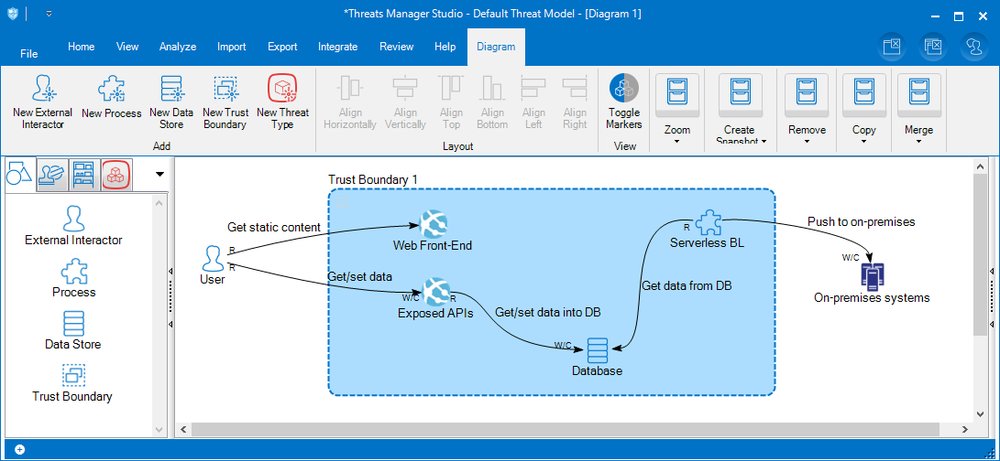
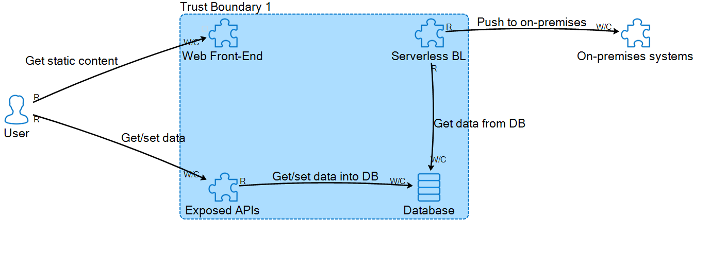

# SampleThreatModelGenerator

A very simple program to generate a sample threat model as shown below.

- The ModelLoader.cs initializes the ThreatModel engine.
- In the Main program, entities like external interactors, processes, datastores and trustboundaries and other dataflow links were added as required like in below image,

- Final output that will be generated is as shown below,

